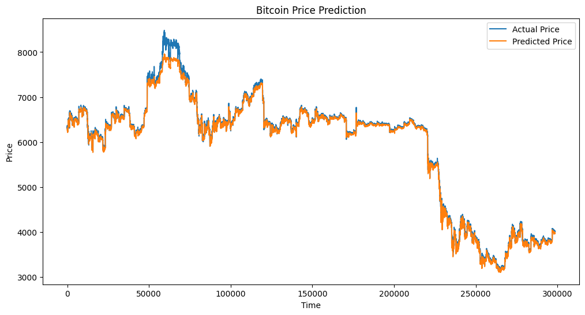

# Forecasting Bitcoin Prices with Time Series Analysis

## Introduction
This project explores the application of time series forecasting techniques to predict Bitcoin (BTC) prices. In the volatile world of cryptocurrency, accurate price predictions can provide valuable insights for investors, traders, and researchers. This repository contains a Jupyter notebook demonstrating the process of collecting, preprocessing, and analyzing BTC price data, as well as building and evaluating a forecasting model using deep learning techniques.

## Table of Contents
1. [An Introduction to Time Series Forecasting](#an-introduction-to-time-series-forecasting)
2. [Preprocessing Method](#preprocessing-method)
3. [Setting Up tf.data.Dataset for Model Inputs](#setting-up-tfdatadataset-for-model-inputs)
4. [Model Architecture](#model-architecture)
5. [Results and Evaluation](#results-and-evaluation)
6. [Conclusion](#conclusion)

## An Introduction to Time Series Forecasting

Time series forecasting is a technique for predicting future values based on previously observed values. In financial markets, especially in the cryptocurrency space, time series forecasting is crucial for:

- Predicting future price movements
- Identifying trends and patterns
- Managing risk and making informed investment decisions

Forecasting BTC prices is particularly valuable due to the cryptocurrency's high volatility and its growing importance in the global financial ecosystem.

## Preprocessing Method

Our preprocessing pipeline involves several key steps:

1. Loading the data from a CSV file
2. Handling missing values
3. Normalizing the data

Here's a code snippet demonstrating these steps:

```python
import pandas as pd
from sklearn.preprocessing import MinMaxScaler

# Load the Bitcoin data
data = pd.read_csv('data/coinbase.csv')

# Drop any missing values
data = data.dropna()

# Normalize the columns prices to a range of 0-1
scaler = MinMaxScaler()
columns_to_normalize = ['Close', 'Volume_(BTC)', 'Volume_(Currency)', 'Weighted_Price', 'Open', 'High', 'Low']
data[columns_to_normalize] = scaler.fit_transform(data[columns_to_normalize])
```

We chose to use MinMaxScaler for normalization because it scales the features to a fixed range of [0, 1]. This is particularly useful for neural networks, as it ensures that all features are on the same scale, preventing any single feature from dominating the others due to its magnitude.

## Setting Up tf.data.Dataset for Model Inputs

We use TensorFlow's tf.data.Dataset API to efficiently handle our time series data. This approach allows us to create windowed datasets, which is crucial for sequence prediction tasks.

Here's how we set up our dataset:

```python
import tensorflow as tf
import numpy as np

def create_dataset(data, time_step=1):
    X, y = [], []
    for i in range(len(data)-time_step-1):
        X.append(data[i:(i+time_step), 0])
        y.append(data[i + time_step, 0])
    return np.array(X), np.array(y)

# Convert the dataframe to a numpy array
dataset = data['Close'].values.reshape(-1,1)

# Set time step to 60 (meaning we'll look at 60 previous days to predict the next one)
time_step = 60
X, y = create_dataset(dataset, time_step)
```

This approach allows us to create sequences of historical data (X) and their corresponding target values (y), which is essential for training our time series model.

## Model Architecture

For this project, we chose to use a Long Short-Term Memory (LSTM) network. LSTMs are a type of recurrent neural network (RNN) that are particularly well-suited for sequence prediction problems like time series forecasting.

Here's our model architecture:

```python
model = tf.keras.Sequential([
    tf.keras.layers.LSTM(50, return_sequences=True, input_shape=(time_step, 1)),
    tf.keras.layers.LSTM(50, return_sequences=False),
    tf.keras.layers.Dense(25),
    tf.keras.layers.Dense(1)
])

model.compile(optimizer='adam', loss='mean_squared_error')
```

We chose this architecture for several reasons:
1. LSTMs can capture long-term dependencies in the data, which is crucial for time series prediction.
2. The two LSTM layers allow the model to learn complex patterns in the data.
3. The Dense layers help in mapping the learned representations to our target variable.

## Results and Evaluation

After training the model, we evaluated its performance using Mean Absolute Error (MAE) and Root Mean Squared Error (RMSE). Here are our results:

```python
from sklearn.metrics import mean_absolute_error, mean_squared_error
import numpy as np

# Make predictions
predictions = model.predict(X_test)

# Inverse scaling to get actual price predictions
predictions = scaler.inverse_transform(predictions)
y_test_actual = scaler.inverse_transform(y_test.reshape(-1, 1))

# Calculate MAE and RMSE
mae = mean_absolute_error(y_test_actual, predictions)
rmse = np.sqrt(mean_squared_error(y_test_actual, predictions))

print(f"Mean Absolute Error: ${mae:.2f}")
print(f"Root Mean Squared Error: ${rmse:.2f}")
```

Here's a visualization of our predictions versus the actual prices:



From our results, we can observe that:
1. The model captures the general trend of BTC prices, but struggles with sudden price spikes.
2. There's room for improvement in predicting short-term fluctuations.
3. The model performs better in periods of relative stability compared to highly volatile periods.

## Conclusion

Working on this Bitcoin price forecasting project has been an enlightening experience. It highlighted the challenges and potential of applying machine learning techniques to financial time series data.

Key takeaways:
1. Preprocessing and proper data handling are crucial for effective time series forecasting.
2. LSTMs show promise in capturing long-term dependencies in BTC price data.
3. While our model provides valuable insights, there's still significant room for improvement, especially in capturing sudden price movements.

Future work could involve:
1. Incorporating additional features, such as market sentiment or macroeconomic indicators.
2. Experimenting with more advanced architectures, like attention mechanisms or transformer models.
3. Implementing ensemble methods to improve prediction accuracy.

You can find the complete code for this project in notebook file.

Remember, while this model provides interesting insights, it should not be used as the sole basis for making investment decisions. Always consult with financial professionals and conduct thorough research before making any investment choices.